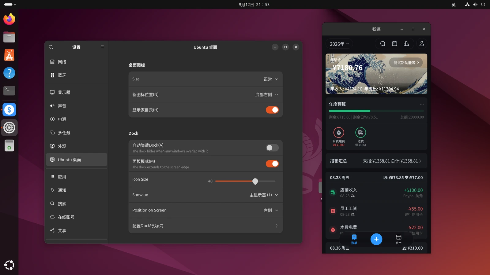
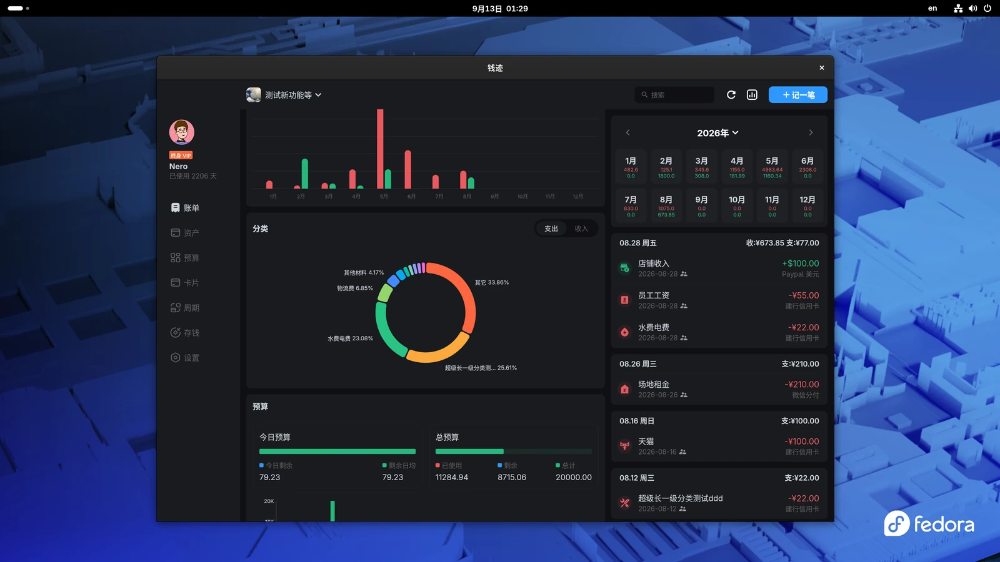
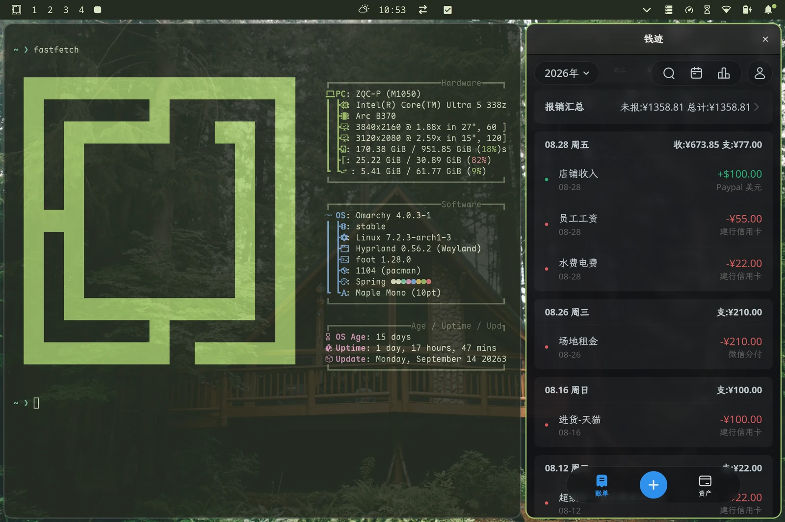

<p align="center">
  
</p>

<h1 align="center">钱迹 Linux</h1>

<p align="center"><strong>简洁、纯粹、高效的个人记账应用</strong></p>

<p align="center">
  <a href="https://www.qianjiapp.com/">官方网站</a> ·
  <a href="https://github.com/litangtech/Qianji-Linux-Release/releases/tag/v4.5.2">版本下载</a> ·
  <a href="#安装">安装指南</a> ·
  <a href="#反馈与安全问题">问题反馈</a>
</p>

---

本仓库提供钱迹 Linux 版官方安装包与安装说明。钱迹是一款支持全平台，专注于个人记账与财务管理的应用。

> [!NOTE]
> Linux 版目前处于测试发布阶段，仅提供 x86_64 架构。安装包通过本仓库的 GitHub Releases 分发。

<details>
<summary><strong>安装效果（点击展开）</strong></summary>

<br>

以下截图来自真实内测场景。

<p align="center">
  <a href="assets/screenshots/qianji-ubuntu-24.webp"></a><br>
  <sub>Ubuntu 24.04 · AppImage</sub>
</p>

<p align="center">
  <a href="assets/screenshots/qianji-fedora-44.webp"></a><br>
  <sub>Fedora 44 · RPM</sub>
</p>

<p align="center">
  <a href="assets/screenshots/qianji-omarchy.webp"></a><br>
  <sub>Arch Linux · Omarchy</sub>
</p>

</details>

## 下载

请从 [v4.5.2 Release](https://github.com/litangtech/Qianji-Linux-Release/releases/tag/v4.5.2) 下载当前版本：

| 适用环境 | 安装包 | 校验文件 |
| :--- | :--- | :--- |
| Ubuntu / Debian | [qianji_v4.5.2-1560-961a8c0c_amd64.deb](https://github.com/litangtech/Qianji-Linux-Release/releases/download/v4.5.2/qianji_v4.5.2-1560-961a8c0c_amd64.deb) | [SHA-256](https://github.com/litangtech/Qianji-Linux-Release/releases/download/v4.5.2/qianji_v4.5.2-1560-961a8c0c_amd64.deb.sha256) |
| Fedora / RPM 系发行版 | [qianji_v4.5.2-1560-961a8c0c_x86_64.rpm](https://github.com/litangtech/Qianji-Linux-Release/releases/download/v4.5.2/qianji_v4.5.2-1560-961a8c0c_x86_64.rpm) | [SHA-256](https://github.com/litangtech/Qianji-Linux-Release/releases/download/v4.5.2/qianji_v4.5.2-1560-961a8c0c_x86_64.rpm.sha256) |
| Arch Linux / Omarchy | [qianji_v4.5.2-1560-961a8c0c_x86_64.pkg.tar.zst](https://github.com/litangtech/Qianji-Linux-Release/releases/download/v4.5.2/qianji_v4.5.2-1560-961a8c0c_x86_64.pkg.tar.zst) | [SHA-256](https://github.com/litangtech/Qianji-Linux-Release/releases/download/v4.5.2/qianji_v4.5.2-1560-961a8c0c_x86_64.pkg.tar.zst.sha256) |
| 其他兼容的 x86_64 桌面发行版 | [qianji_v4.5.2-1560-961a8c0c_amd64.AppImage](https://github.com/litangtech/Qianji-Linux-Release/releases/download/v4.5.2/qianji_v4.5.2-1560-961a8c0c_amd64.AppImage) | [SHA-256](https://github.com/litangtech/Qianji-Linux-Release/releases/download/v4.5.2/qianji_v4.5.2-1560-961a8c0c_amd64.AppImage.sha256) |

根据自身系统下载对应安装包即可。

## 校验下载

每个安装包都附带同名 `.sha256` 文件。进入下载文件所在目录后执行：

```bash
sha256sum -c qianji_*.sha256
```

该命令会依次读取当前目录中所有钱迹安装包的 `.sha256` 文件，并校验对应安装包。若只下载了一种格式，也可以直接指定它的校验文件，例如：

```bash
sha256sum -c qianji_v4.5.2-1560-961a8c0c_amd64.deb.sha256
```

> [!IMPORTANT]
> 只有对应文件显示 `OK` 时才继续安装。校验失败时请重新下载，不要运行该文件。

## 安装

### Ubuntu / Debian

```bash
sudo apt install ./qianji_v4.5.2-1560-961a8c0c_amd64.deb
```

卸载：

```bash
sudo apt remove qianji
```

### Fedora / RPM 系发行版

```bash
sudo dnf install ./qianji_v4.5.2-1560-961a8c0c_x86_64.rpm
```

卸载：

```bash
sudo dnf remove qianji
```

### Arch Linux / Omarchy

```bash
sudo pacman -U ./qianji_v4.5.2-1560-961a8c0c_x86_64.pkg.tar.zst
```

卸载：

```bash
sudo pacman -Rns qianji
```

### AppImage

无需安装即可直接运行：

```bash
chmod +x qianji_v4.5.2-1560-961a8c0c_amd64.AppImage
./qianji_v4.5.2-1560-961a8c0c_amd64.AppImage
```

如需为当前用户注册应用菜单和图标，请下载 [install-qianji-appimage.sh](https://github.com/litangtech/Qianji-Linux-Release/releases/download/v4.5.2/install-qianji-appimage.sh)，并与 AppImage、对应 `.sha256` 文件放在同一目录，然后执行：

```bash
chmod +x install-qianji-appimage.sh
./install-qianji-appimage.sh ./qianji_v4.5.2-1560-961a8c0c_amd64.AppImage
```

该方式不需要 `sudo`。升级时用新 AppImage 重复执行安装器。

卸载：

```bash
~/.local/share/qianji-appimage/manage-qianji-appimage.sh --uninstall
```

## 已验证环境

- Ubuntu 22.04
- Ubuntu 24.04
- Fedora 44
- Arch Linux / Omarchy

其他 Linux 发行版可尝试使用 AppImage。

## 反馈与安全问题

一般问题可通过钱迹应用内的反馈功能提交，也可发送邮件至 [a@qianji.app](mailto:a@qianji.app)。Linux 版安装/使用问题也可以直接在本仓库提交 Issue。

> [!CAUTION]
> 安全问题请勿在公开 Issue 中披露，请直接邮件联系。

## 使用与分发

钱迹是专有软件。本仓库公开的是官方编译产物与辅助安装脚本，并非源代码。下载或使用前请阅读：

- [分发声明](DISTRIBUTION-NOTICE.md)
- [用户协议](https://docs.qianjiapp.com/user_agreement.html)
- [隐私政策](https://docs.qianjiapp.com/privacy_policy_android_hd.html)
